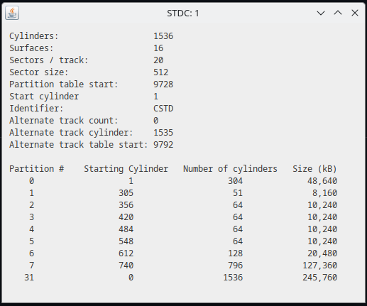
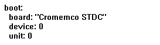
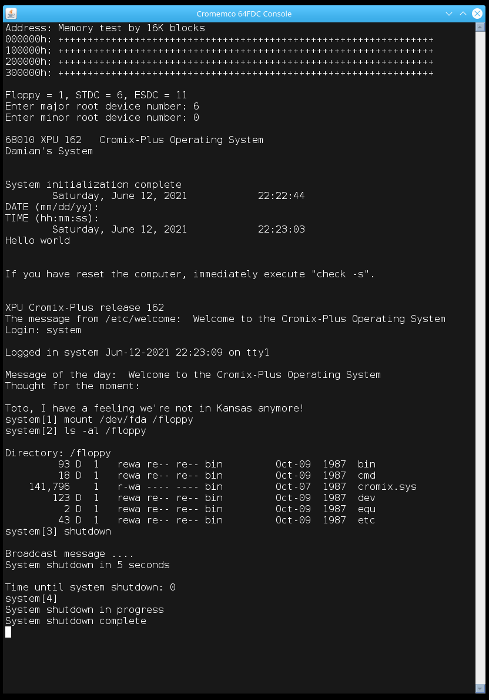

# cromix-emu

A software emulation of Cromemco hardware to run Cromix Plus.

Usage: java -jar s100-68k-emu-1.1.jar -configfile ./Cromix-cromemco.yaml -g

## Release 1.1
* Requires Java 17 runtime
* Minimal UI for 64FDC and STDC
* Boots from IMD floppy images (large only)
* Boots from partitioned ST images

### UI
The UI displays the current status and activity for the 64FDC and STDC drives.  
The 64FDC drives can be ejected and loaded.

Note: The emulator loads and operates on the 64FDC and STDC disk images in memory, changes to the disk image files are not automatically persisted to disk.  You must use the Sync buttons to persist any changes.

The info icons display the STDC disk parameters and partition table.

### Boot device

The default boot device is configured in the boot section of the config file which is in yaml format, https://yaml.org/spec/1.2.2.

Whilst running, the boot device can be changed and the emulation rebooted via the UI.

#### Boot section

* **board:** Can be either "Cromemco 64FDC" or "Cromemco STDC"
* **device:** The index of the device: 0,1,2,3 for the 64FDC or 0,1 for the STDC
* **unit:** Ignored for the 64FDC, the partition index for the STDC

### Using Gesswein MFM emulator HDD files
The .hdd file must be converted to a raw image file using the mfm_util utility, https://github.com/dgesswein/mfm.git

`mfm_util --emulation_file 20220705.D45.C1536.H16.master.hdd --extracted_data_file 20220705.D45.C1536.H16.master.img -a`

# Previous releases
## Release 1.0

Requires Java 8 (minimum) runtime

Usage: java -jar s100-68k-emu-1.0.jar -configfile ./Cromix-cromemco.yaml -g

